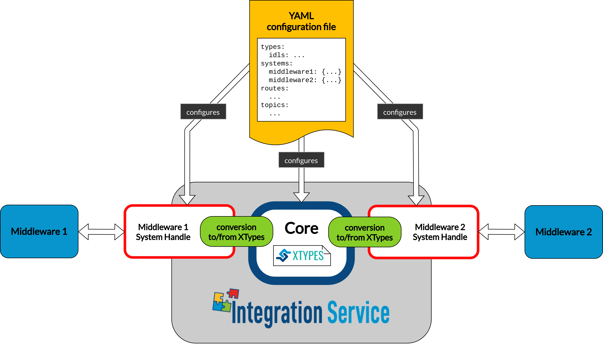

<a href="https://integration-service.docs.eprosima.com"></a>


# Introduction
[](https://github.com/eProsima/Integration-Service/actions)

*eProsima Integration Service* is a **Linux** tool that enables communication among
an arbitrary number of protocols that speak different languages.

This project was born as a joint effort between [Open Robotics](https://www.openrobotics.org/)
and [eProsima](https://eprosima.com), which nowadays is in charge of maintaining it.



It works by translating the languages of the systems involved to a common representation language that follows the
[Extensible and Dynamic Topic Types for DDS](https://www.omg.org/spec/DDS-XTypes/About-DDS-XTypes/)
(**xTypes**) standard by the [OMG](https://www.omg.org/); specifically, *Integration Service*
bases its intercommunication abilities on eProsima's open source implementation
for the *xTypes* protocol, that is, [eProsima xTypes](https://github.com/eProsima/xtypes).

The translation is mediated by system-specific plugins, or **System Handles**,
allowing to communicate the middlewares involved with the **core**, that speaks the common *xTypes* representation language.
This is carried out by interfacing each entity in the user application with a complimentary
"mirror" proxy in the *System Handle* (SH), able to communicate with the former according to either a pub/sub or service pattern. Namely:

* A subscriber in the SH for a publisher in the user app.
* A publisher in the SH for a subscriber in the user app.
* A client in the SH for a server in the user app.
* A server in the SH for a client in the user app.

*Integration Service* can be launched using the command line, as follows:

```
~/is_ws$ integration-service <filename>.yaml
```

It is recommended to use [colcon](https://colcon.readthedocs.io/en/released/) to build and install the
*Integration Service* executable and its associated middleware plugins; for more information, please refer to
the `Installation manual` section in the [documentation](#documentation) chapter of this document.

# Configuration

The *Integration Service* can be configured during runtime by means of a dedicated **YAML** file.
This configuration file must follow a specific syntax, meaning that it is required that a number
of compulsory section are opportunely filled for it to successfully configure and launch an *Integration Service* instance,
while others are optional. Both kinds are listed and reviewed below:

* `types` *(optional)*: It allows to list the [IDL](https://www.omg.org/spec/IDL/4.2/About-IDL/)
  types used by the *Integration Service* to later define the topics and services types which will
  take part in the communication process.

  This field can be omitted for certain *Integration Service* instances where one or more *System
  Handles* already include(s) static type definitions and their corresponding transformation libraries
  (*Middleware Interface Extension* or *mix* files).

  ```yaml
    types:
      idls:
        - >
          #include <GoodbyeWorld.idl>
          struct HelloWorld
          {
            string data;
            GoodbyeWorld bye;
          };
      paths: [ "/home/idl_files/goodbyeworld/" ]
  ```

  <details>
  <summary>Several parameters can be configured within this section: <i>(click to expand)</i></summary>

    * `idls`: List of IDL type definitions that can be directly embedded within the configuration file. If the `types` section is defined, this subsection is mandatory. The type can be entirely defined within the YAML file, or can be included from a preexisting IDL file; for the latter, the system path containing where the IDL file is stored must be placed into the `paths` section described below.

    * `paths` *(optional):* Using this parameter, an existing IDL type written in a separate file can be included within the *Integration Service* types section. If the IDL path is not listed here, the previous subsection `#include` preprocessor directive will fail.

  </details>

* `systems`: Specifies which middlewares will be involved in the communication process, allowing
  to configure them individually.

  Some configuration parameters are common for all the supported middlewares within the
  *Integration Service* ecosystem; while others are specific of each middleware. To see which
  parameters are relevant for a certain middleware, please refer to its dedicated *README* section
  in its corresponding GitHub repository, under the name of `https://github.com/eProsima/<MW_NAME>-SH`.

  ```yaml
    systems:
      foo: { type: foo }
      bar: { type: bar, types-from: foo }
  ```

  <details>
  <summary>In relation to the common parameters, their behaviour is explained in the following section: <i>(click to expand)</i></summary>

    * `type`: Middleware or protocol kind. To date, the supported middlewares are: *fastdds*, *fiware*, *ros1*, *ros2*, *websocket_client* and *websocket_server*. There is also a *mock* option, mostly used
    for testing purposes.

    * `types-from` *(optional)*: Configures the types inheritance from a given system to another. This allows to use types defined within *Middleware Interface Extension* files for a certain middleware into another middleware, without the need of duplicating them or writing an equivalent IDL type for the rest of systems.

  </details>

* `routes`: In this section, a list must be introduced, corresponding to which bridges are needed by
  *Integration Service* in order to fulfill the intercommunication requirements
  for a specific use case.

  At least one route is required; otherwise, running *Integration Service* would be useless.

  ```yaml
    routes:
      foo_to_bar: { from: foo, to: bar }
      bar_to_foo: { from: bar, to: foo }
      foo_server: { server: foo, clients: bar }
      bar_server: { server: bar, clients: foo }
  ```

  <details>
  <summary>There are two kinds of routes, corresponding to either a publication/subscription paradigm or a
  server/client paradigm: <i>(click to expand)</i></summary>

  * `from` - `to`: Defines a route **from** one (or several) system(s) **to** one (or several) system(s).
    A `from` system expects to connect a publisher user application with a subscriber user application in the `to` system.

  * `server` - `clients`: Defines a route for a request/reply architecture in which there are one or several
    **clients** which forward request petitions and listen to responses coming from a **server**,
    which must be unique for each service route.
  </details>

* `topics`: Specifies the topics exchanged over the `routes` listed above corresponding to the
  publication-subscription paradigm. The topics must be specified in the form of a YAML dictionary,
  meaning that two topics can never have the same name.

  For each topic, some configuration parameters are common for all the supported middlewares within the
  *Integration Service* ecosystem; while others are specific of each middleware. To see which topic
  parameters must/can be configured for a certain middleware, please refer to its dedicated *README* section
  in its corresponding GitHub repository, under the name of `https://github.com/eProsima/<MW_NAME>-SH`.

  ```yaml
    topics:
      hello_foo:
        type: HelloWorld
        route: bar_to_foo
      hello_bar:
        type: HelloWorld
        route: foo_to_bar
        remap: { bar: { topic: HelloBar } }
  ```

  <details>
  <summary>In relation to the common parameters, their behaviour is explained below: <i>(click to expand)</i></summary>

  * `type`: The topic type name. This type must be defined in the `types` section of the YAML
    configuration file, or it must be loaded by means of a `Middleware Interface Extension` file
    by any of the middleware plugins or *System Handles* involved in the communication process.

  * `route`: Communication bridge to be used for this topic. The route must be one among those defined in the
    `routes` section described above.

  * `remap` *(optional):* Allows to establish equivalences between the **topic** name and its **type**,
    for any of the middlewares defined in the used route. This means that the topic name and
    type name may vary in each user application endpoint that is being bridged, but,
    as long as the type definition is equivalent, the communication will still be possible.
  </details>

* `services`: Allows to define the services that *Integration Service* will be in charge of
  bridging, according to the service `routes` listed above for the client/server paradigm.
  The services must be specified in the form of a YAML dictionary, meaning that two services can
  never have the same name.

  For each service, some configuration parameters are common for all of the supported middlewares
  within the *Integration Service* ecosystem; while others are specific of each middleware.
  To see which parameters must/can be configured for a certain middleware in the context of a service
  definition, please refer to its dedicated *README* section in its corresponding GitHub repository,
  under the name of `https://github.com/eProsima/<MW_NAME>-SH`.

  ```yaml
  services:
    serve_foo:
      request_type: FooRequest
      reply_type: FooReply
      route: foo_server
    serve_bar:
      request_type: BarRequest
      reply_type: BarReply
      route: bar_server
      remap: { foo: { request_type: bar_req, reply_type: bar_repl, topic: ServeBar } }
  ```

  <details>
  <summary>Regarding the common parameters, they differ slightly from the `topics` section: <i>(click to expand)</i></summary>

  * `type` *(optional):* The service type. As services usually are composed of a request and a reply, this field
    only makes sense for those services which consist solely of a request action with no reply.
    Usually, within the `services` context, it is not used at all.

  * `request_type`: The service request type. This type must be defined in the `types` section of the YAML
    configuration file, or must be loaded by means of a `Middleware Interface Extension` file
    by any of the middleware plugins, or *System Handles*, involved in the communication process.

  * `reply_type`: The service reply type. This type must be defined in the `types` section of the YAML
    configuration file, or must be loaded by means of a `Middleware Interface Extension` file
    by any of the middleware plugins, or *System Handles*, involved in the communication process.

  * `route`: Communication bridge to be used for this service. The route must be one among those defined in the
    `routes` section described above and must be a route composed of a *server* and one or more *clients*.

  * `remap` *(optional):* Allows to establish equivalences between the **service** name (*topic* field) and its
    **request and reply type**, for any of the middlewares defined in the used route.
    This means that the service name and types names may vary in each user application endpoint
    that is being bridged, but, as long as the type definition is equivalent, the communication will still be possible.
  </details>

Finally, it is important to remark that both the `services` and `topics` sections are not mandatory,
meaning that an *Integration Service* instance can be launched only for publication/subscription
bridging, or solely to perform service type communications. However, they are not exclusive,
and can coexist under the same YAML configuration file.
# Supported middlewares and protocols

All of the currently protocols are integrated within *Integration Service*
by means of dedicated plugins or **System Handles**.

The complete *System Handles* set for the *Integration Service* is currently composed of the following protocols:

* [Fast DDS System Handle](https://github.com/eProsima/FastDDS-SH)

* [FIWARE System Handle](https://github.com/eProsima/FIWARE-SH)

* [ROS 1 System Handle](https://github.com/eProsima/ROS1-SH)

* [ROS 2 System Handle](https://github.com/eProsima/ROS2-SH)

* [WebSocket System Handle](https://github.com/eProsima/WebSocket-SH)

Additionally, creating a *System Handle* is a relatively easy task and allows to integrate a new
protocol to the *Integration System* infrastructure, which automatically provides the new protocol
with communication capabilities towards all of the aforementioned middlewares and protocols.

For more information, please refer to the [System Handle user manual](https://integration-service.docs.eprosima.com/en/latest/user_manual/systemhandle/sh.html#)
and [System Handle API reference](https://integration-service.docs.eprosima.com/en/latest/api_reference/core/systemhandle/api_systemhandle.html) sections, available in the official documentation.

# Compilation flags

*Integration Service* uses `CMake` for building and packaging the project.
There are several CMake flags, which can be tuned during the configuration step:

* `BUILD_TESTS`: When compiling *Integration Service*, use the `-DBUILD_TESTS=ON` CMake option
  to compile both the unitary tests for the [Integration Service Core](core/) and the unitary
  and integration tests for all the *System Handles* present in the `colcon` workspace:

  ```bash
  ~/is_ws$ colcon build --cmake-args -DBUILD_TESTS=ON
  ```

* `BUILD_EXAMPLES`: Allows to compile utilities that can be used for the several provided
  usage examples for *Integration Service*, located under the [examples/utils](examples/utils/) folder.
  These applications can be used to test the *Integration Service* with some of the provided YAML configuration
  files, which are located under the [examples/basic](examples/basic) directory:

  ```bash
  ~/is_ws$ colcon build --cmake-args -DBUILD_EXAMPLES=ON
  ```
  <details>
  <summary>To date, the following user application examples are available: <i>(click to expand)</i></summary>

  * `DDSHelloWorld`: A simple publisher/subscriber application, running under [Fast DDS](https://fast-dds.docs.eprosima.com/).
    It publishes or subscribes to a simple string topic, named *HelloWorldTopic*.
    As an alternative to `colcon`, in order to compile the `DDSHelloWorld` example, the following commands can be executed:

    ```bash
    ~/is_ws$ cd examples/utils/DDSHelloWorld
    ~/is_ws/examples/utils/DDSHelloWorld$ mkdir build
    ~/is_ws/examples/utils/DDSHelloWorld$ cd build
    ~/is_ws/examples/utils/DDSHelloWorld/build$ cmake ..
    ~/is_ws/examples/utils/DDSHelloWorld$ make
    ```
    The resulting executable will be located inside the `build` folder, and named `DDSHelloWorld`.

  </details>

# Documentation

The official documentation for *eProsima Integration Service* is hosted by Read the Docs,
and comprises the following sections:

* [Introduction](https://integration-service.docs.eprosima.com/en/latest/index.html)
* [Installation Manual](https://integration-service.docs.eprosima.com/en/latest/installation_manual/installation_manual.html)
* [User Manual](https://integration-service.docs.eprosima.com/en/latest/user_manual/user_manual.html)
* [API Reference](https://integration-service.docs.eprosima.com/en/latest/api_reference/api_reference.html)
* [Examples](https://integration-service.docs.eprosima.com/en/latest/examples/examples.html)
* [Release Notes](https://integration-service.docs.eprosima.com/en/latest/release_notes/release_notes.html)

# License

This repository is open-sourced under the *Apache-2.0* license. See the [LICENSE](LICENSE) file for more details.

# Getting help

If you need support you can reach us by mail at `support@eProsima.com` or by phone at `+34 91 804 34 48`.
