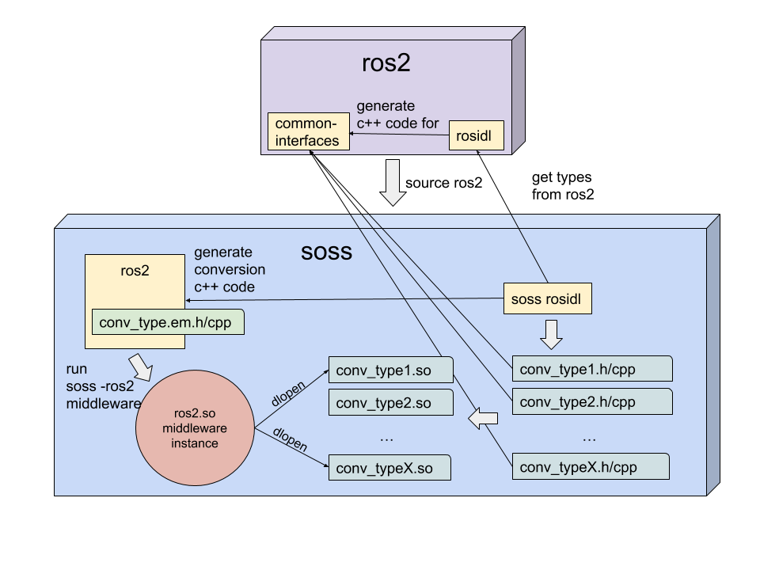

# Design

## Ros2 type inference: compilation and load phases.

## Sequence diagram

## Future work
*eProsima* is planning to replace this whole system with a brand new one, that includes a C++ parser for **msg** and **srv** types.
This parser will automatically generate a dynamic representation of the type using [eprosima xTypes](https://github.com/eProsima/xtypes),
so no conversion library will be needed for each specific type and we can remove the code generation part and the dynamic library load
process of *.mix* files for each ROS 2 type that it is desired to use in the intercommunication process between the *ROS 2 SystemHandle* and other plugins.

